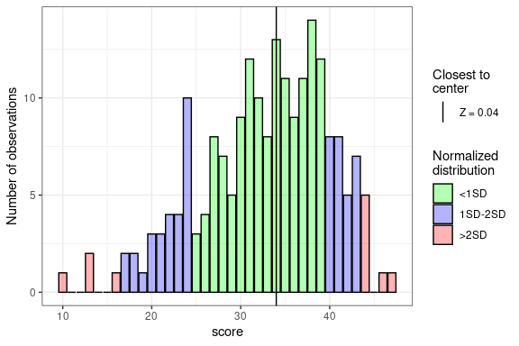
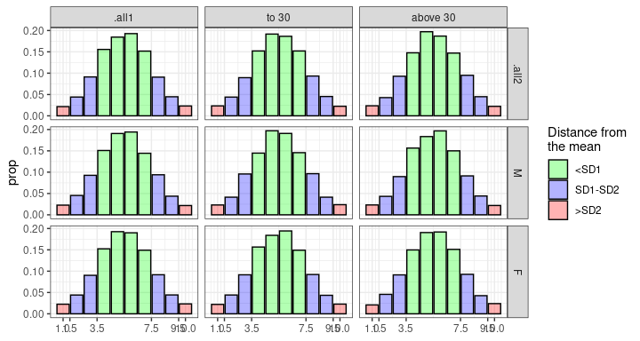

<!-- README.md is generated from README.Rmd. Please edit that file -->

# stenR 

<!-- badges: start -->

[](https://lifecycle.r-lib.org/articles/stages.html#experimental)
[](https://codecov.io/gh/StatisMike/stenR)
<!-- badges: end -->

`stenR` is a package tailored mainly for users and creators of
psychological questionnaires, though other social science researchers
and survey authors can benefit greatly from it.

It provides tools to help with processes necessary for conducting such
studies:

1.  processing data from raw item scores to raw factor/scale scores
2.  standardization of the raw scores into standard scale of your
    choosing, either by:
    -   normalization of the raw scores using frequency table (if no
        norms have been developed before). Usually for authors of
        questionnaires or their adaptations.
    -   importing scoring table developed by questionnaire authors - for
        researchers only using the measure

Furthermore, tools for developing or using norms on grouped basis are
also provided (up to two intertwined grouping conditions are supported).

More in-depth description is provided in **Usage** section.

## Installation

You can install the current version from [GitHub](https://github.com/)
with:

``` r
# install.packages("devtools")
devtools::install_github("StatisMike/stenR")
```

## Usage

As there are few fairly independent and varied processes supported in
the `stenR`, they will be described separately below. For more details,
browse through vignettes and documentation for functions.

``` r
library(stenR)
```

### Processing raw item scores to raw factor/scales

After conducting the study, results will be usually available in form of
responses in some scoring scale for each separate items. For further
analysis they need to be gathered into scales and factors (unless they
are one-item scale).

`stenR` provides functions to make this process straightforward.

We will use one of the datasets provided with the package: `SLCS`,
containing responses for items in Self-Liking Self-Competence Scale. It
consists of 16 items, which can be grouped into two subscales
(Self-Liking, Self-Competence) and General Score.

``` r
str(SLCS)
#> 'data.frame':    103 obs. of  19 variables:
#>  $ user_id: chr  "damaged_kiwi" "unilateralised_anglerfish" "technical_anemonecrab" "temperate_americancurl" ...
#>  $ sex    : chr  "M" "K" "K" "K" ...
#>  $ age    : int  30 31 22 26 22 17 27 24 20 19 ...
#>  $ SLCS_1 : int  4 5 4 5 5 5 5 4 4 5 ...
#>  $ SLCS_2 : int  2 2 4 3 2 3 1 5 2 1 ...
#>  $ SLCS_3 : int  1 2 4 2 3 1 1 4 1 2 ...
#>  $ SLCS_4 : int  2 1 4 2 4 2 1 4 4 2 ...
#>  $ SLCS_5 : int  2 2 4 1 2 2 2 4 2 2 ...
#>  $ SLCS_6 : int  4 4 5 5 5 5 1 2 5 4 ...
#>  $ SLCS_7 : int  4 4 4 5 3 5 2 3 5 3 ...
#>  $ SLCS_8 : int  4 5 4 5 4 5 5 4 4 5 ...
#>  $ SLCS_9 : int  2 3 2 1 3 1 1 4 1 1 ...
#>  $ SLCS_10: int  4 4 3 4 4 4 5 4 5 5 ...
#>  $ SLCS_11: int  1 1 2 1 1 2 1 3 1 1 ...
#>  $ SLCS_12: int  4 2 4 3 3 2 2 4 3 1 ...
#>  $ SLCS_13: int  4 5 5 4 3 4 4 4 5 5 ...
#>  $ SLCS_14: int  2 1 3 2 4 1 1 4 1 1 ...
#>  $ SLCS_15: int  5 4 4 4 4 3 3 2 5 4 ...
#>  $ SLCS_16: int  4 5 5 4 5 4 5 5 5 5 ...
```

To summarize scores we need to create *ScaleSpec* objects with
`ScaleSpec()` constructor function. Such objects contain instructions
for R how the scales are structured, most importantly:

-   **name**: name of the resulting variable
-   **item_names**: names of variables which will be summed to the scale
-   **reverse**: names of the variables that need to have their scores
    reversed
-   **min**, **max**: absolute min and max of raw scores

``` r
SL_spec <- ScaleSpec(
  name = "SelfLiking", min = 1, max = 5,
  item_names = c("SLCS_1", "SLCS_3", "SLCS_5", "SLCS_6", "SLCS_7", 
                 "SLCS_9", "SLCS_11", "SLCS_15"),
  reverse = c("SLCS_1", "SLCS_6", "SLCS_7", "SLCS_15")
)
SC_spec <- ScaleSpec(
  name = "SelfCompetence", min = 1, max = 5,
  item_names = c("SLCS_2", "SLCS_4", "SLCS_8", "SLCS_10", "SLCS_12",
                 "SLCS_13", "SLCS_14", "SLCS_16"),
  reverse = c("SLCS_8", "SLCS_10", "SLCS_13")
)
```

If there are main factors or factors of higher level, the `ScaleSpec`
objects can be also combined into *CombScaleSpec* object with
`CombScaleSpec()` constructor function. In our example the **General
Score** is such factor.

``` r
GS_spec <- CombScaleSpec(
  name = "GeneralScore",
  SL_spec, SC_spec
)

# subscales can be also reversed
GS_with_rev <- CombScaleSpec(
  name = "rev_example",
  SL_spec, SC_spec,
  reverse = "SelfCompetence"
)
```

When all scale specifications are ready, they can be then used to get
the factor/scale data, summarized in accordance to the instructions in
provided *ScaleSpec* or *CombScaleSpec* objects.

``` r
summed_SCLS <- sum_items_to_scale(
  SLCS,
  SL_spec,
  SC_spec,
  GS_spec,
  GS_with_rev
)

str(summed_SCLS)
#> 'data.frame':    103 obs. of  4 variables:
#>  $ SelfLiking    : int  13 15 19 10 16 12 18 28 10 14 ...
#>  $ SelfCompetence: int  20 15 26 19 25 17 14 28 19 13 ...
#>  $ GeneralScore  : int  33 30 45 29 41 29 32 56 29 27 ...
#>  $ rev_example   : int  41 48 41 39 39 43 52 48 39 49 ...
```

### Normalize scores with FrequencyTable

For the times when you have great number of observations and prefer to
develop norms (usually, when you are creator of questionnaire or its
adaptation) it is recommended to generate *FrequencyTable* and
*ScoreTable* objects. Resulting *ScoreTable* objects can be either used
to normalize the scores or create exportable to non-R specific objects
*ScoringTable* object.

> There are also support for automatic grouping the observations using
> *GroupedFrequencyTable* and *GroupedScoreTable* objects. They will be
> mentioned in **Grouping** section.

We will use one of the datasets provided with the package: `HEXACO_60`,
containing raw scores of scales in HEXACO 60-item questionnaire.

``` r
str(HEXACO_60)
#> 'data.frame':    204 obs. of  9 variables:
#>  $ user_id: chr  "neutral_peregrinefalcon" "trapeziform_zebradove" "polyhedral_solenodon" "decrepit_norwayrat" ...
#>  $ sex    : chr  "F" "F" "F" "F" ...
#>  $ age    : int  26 24 26 25 31 25 62 19 24 26 ...
#>  $ HEX_H  : int  42 38 18 21 32 34 37 39 41 30 ...
#>  $ HEX_E  : int  33 31 17 24 35 30 37 13 33 24 ...
#>  $ HEX_X  : int  34 36 16 29 24 34 39 27 23 34 ...
#>  $ HEX_A  : int  36 44 42 22 31 34 23 27 15 21 ...
#>  $ HEX_C  : int  36 36 35 43 34 28 41 19 49 38 ...
#>  $ HEX_O  : int  31 28 37 47 28 39 44 42 22 38 ...
```

1.  Create *FrequencyTable* objects

    At first, we need to create a *FrequencyTable* object for each
    variable using `FrequencyTable()` constructor function.

    ``` r
    HEX_C_ft <- FrequencyTable(HEXACO_60$HEX_C)
    HEX_E_ft <- FrequencyTable(HEXACO_60$HEX_E)
    #> ℹ There are missing raw score values between minimum and maximum raw scores.
    #>   They have been filled automatically.
    #>   No. missing: 5/38 [13.16%]
    ```

    If there are some missing raw scores in your data, helpful message
    will be displayed. You can check how the frequencies look like using
    `plot()` function.

    ``` r
    plot(HEX_E_ft)
    ```

    <!-- -->

    As we can see, the missing values are gathered near tails of the
    distribution. It can happen even with many observations - and in
    case of our sample (103 observations) it is very likely.

2.  Create *ScoreTable* objects

    *ScoreTable* object is basically a frequency table with additional
    standard scale specification attached. We can create our own
    specification using `StandardScale()`, but we will use in the
    example already provided `STEN` (Standard TEN) score specification

    ``` r
    HEX_C_st <- ScoreTable(
      ft = HEX_C_ft,
      scale = STEN
    )
    HEX_E_st <-ScoreTable(
      ft = HEX_E_ft,
      scale = STEN
    )
    ```

3.  Normalize and standardize scores

    Created *ScoreTable*s can be then used to calculate the normalized
    scores. Normalization can be done either on individual vectors with
    basic `normalize_score()` function:

    ``` r
    HEX_C_norm <- normalize_score(
      HEXACO_60$HEX_C,
      table = HEX_C_st,
      what = "sten"
    )
    HEX_E_norm <- normalize_score(
      HEXACO_60$HEX_E,
      table = HEX_E_st,
      what = "sten"
    )
    summary(HEX_C_norm)
    #>    Min. 1st Qu.  Median    Mean 3rd Qu.    Max. 
    #>   1.000   4.000   5.000   5.495   7.000  10.000
    summary(HEX_E_norm)
    #>    Min. 1st Qu.  Median    Mean 3rd Qu.    Max. 
    #>   1.000   4.000   6.000   5.539   7.000  10.000
    ```

    Or using the convienient wrapped for whole *data.frame*

    ``` r
    HEX_CE_norm <- normalize_scores_df(
      data = HEXACO_60,
      vars = c("HEX_C", "HEX_E"),
      HEX_C_st,
      HEX_E_st,
      what = "sten",
      # by default no other variables will be retained
      retain = FALSE
    )
    summary(HEX_CE_norm)
    #>      HEX_C            HEX_E       
    #>  Min.   : 1.000   Min.   : 1.000  
    #>  1st Qu.: 4.000   1st Qu.: 4.000  
    #>  Median : 5.000   Median : 6.000  
    #>  Mean   : 5.495   Mean   : 5.539  
    #>  3rd Qu.: 7.000   3rd Qu.: 7.000  
    #>  Max.   :10.000   Max.   :10.000
    str(HEX_CE_norm)
    #> 'data.frame':    204 obs. of  2 variables:
    #>  $ HEX_C: num  6 6 5 8 5 3 7 1 10 6 ...
    #>  $ HEX_E: num  5 5 2 3 6 5 6 1 5 3 ...
    ```

### Normalize scores using imported ScoringTable

Most users will be using already developed norms by the creators of
questionnaire. Scoring tables should be provided in the measure
documentation, and *ScoringTable* object is mirroring their usual
representation.

*ScoringTable* object can be either created from *ScoreTable* or
*GroupedScoreTable* object or imported from **csv** or **json** file.

For manual creation, the **csv** format is recommended. Such file should
look similar to the one below (which is created on basis of
Consciousness *ScoreTable* from code in section above)

``` csv
"sten","Score"
1,"10-19"
2,"20-25"
3,"26-28"
4,"29-31"
5,"32-35"
6,"36-39"
7,"40-42"
8,"43-46"
9,"47-48"
10,"49-50"
```

-   first column should contain the standardized scores
-   second column should contain the raw scores in pattern of
    `{min}-{max}` that need to be changed into each standardized score

> *ScoringTable* objects also supports different groups of
> observations - in that case 2nd to n-th columns are reflecting scores
> for each of the group. They will be mentioned in **Grouping** section.

We can import *ScoringTable*s using `import_ScoringTable()` function.

``` r
HEX_C_Scoring <- import_ScoringTable(
  source = C_ScoringTable,
  method = "csv"
)
HEX_E_Scoring <- import_ScoringTable(
  source = E_ScoringTable,
  method = "csv"
)
summary(HEX_C_Scoring)
#> <ScoringTable>
#> No. groups: ungrouped
#> Scale: "sten"; `min`: 1; `max`: 10
summary(HEX_E_Scoring)
#> <ScoringTable>
#> No. groups: ungrouped
#> Scale: "sten"; `min`: 1; `max`: 10
```

They can be then used to normalize scores, very similarly to
`normalize_scores_df`:

``` r
HEX_CE_norm <- normalize_scores_scoring(
  data = HEXACO_60,
  vars = c("HEX_C", "HEX_E"),
  HEX_C_Scoring,
  HEX_E_Scoring
)
summary(HEX_CE_norm)
#>      HEX_C            HEX_E       
#>  Min.   : 1.000   Min.   : 1.000  
#>  1st Qu.: 4.000   1st Qu.: 4.000  
#>  Median : 5.000   Median : 6.000  
#>  Mean   : 5.495   Mean   : 5.539  
#>  3rd Qu.: 7.000   3rd Qu.: 7.000  
#>  Max.   :10.000   Max.   :10.000
str(HEX_CE_norm)
#> 'data.frame':    204 obs. of  2 variables:
#>  $ HEX_C: num  6 6 5 8 5 3 7 1 10 6 ...
#>  $ HEX_E: num  5 5 2 3 6 5 6 1 5 3 ...
```

### Groupings

Very often the norms are different for different groups: most often
varying in some demographic variables, like biological sex or biological
age. `stenR` functions provide support for such groups by intoducing
*Grouped* variants of *FrequencyTable* and *ScoreTable* (regular
*ScoringTable* supports them) and *GroupConditions* class.

*GroupConditions* works similarly to *ScaleSpec* and *CombScaleSpec*
objects: it provides information about how to assign observations. They
need the name of category (mainly for informative reasons) and
conditions following the syntax of name of the group on the LHS and
boolean condition on the RHS.

``` r
sex_grouping <- GroupConditions(
  conditions_category = "Sex",
  "M" ~ sex == "M",
  "F" ~ sex == "F"
)
age_grouping <- GroupConditions(
  conditions_category = "Age",
  "to 30" ~ age < 30,
  "above 30" ~ age >= 31
)
sex_grouping
#> <GroupConditions>
#> Conditions category: Sex
#> Tested variables: "sex"
#> 2 Groups:
#> • M IF: sex == "M"
#> • F IF: sex == "F"
#> Forced disjointedness by default: TRUE
#> Forced exhaustiveness by default: FALSE
age_grouping
#> <GroupConditions>
#> Conditions category: Age
#> Tested variables: "age"
#> 2 Groups:
#> • to 30 IF: age < 30
#> • above 30 IF: age >= 31
#> Forced disjointedness by default: TRUE
#> Forced exhaustiveness by default: FALSE
```

They can be then used to create a *GroupedFrequencyTable*, and following
that: *GroupedScoreTable* and, optionally, *ScoringTable* - or to create
*ScoringTable* during import.

For this examples we will be using `IPIP_NEO_300` dataset provided with
the package. It contains the *age* and *sex* variables, and summed raw
scores of 5 scales from IPIP NEO questionnaire (300 item version).

``` r
str(IPIP_NEO_300)
#> 'data.frame':    13161 obs. of  7 variables:
#>  $ sex: chr  "F" "F" "F" "M" ...
#>  $ age: int  25 18 16 23 25 26 23 66 19 36 ...
#>  $ N  : int  187 209 209 167 163 193 NA 95 251 NA ...
#>  $ E  : int  NA 222 165 176 195 145 229 174 NA 194 ...
#>  $ O  : int  234 224 197 180 209 243 237 198 NA 266 ...
#>  $ A  : int  221 178 224 182 243 231 234 269 NA 184 ...
#>  $ C  : int  234 178 224 224 217 219 232 235 176 NA ...
```

1.  *GroupedFrequencyTable*, *GroupedScoreTable* and *ScoringTable*
    export

    Workflow is very similiar to the ungrouped tables.

    ``` r
    N_gft <- GroupedFrequencyTable(
      data = IPIP_NEO_300,
      conditions = list(age_grouping, sex_grouping),
      var = "N",
      # By default, norms are are also computed for '.all' groups. These are
      # used if by any reason observation can't be assigned to any group
      # in corresponding condition category
      .all = TRUE
    )
    #> ℹ There are missing raw score values between minimum and maximum raw scores for
    #>   some groups. They have been filled automatically.
    #> • to 30:M No. missing: 8/214; 3.74%
    #> • to 30:F No. missing: 28/220; 12.73%
    #> • to 30:.all2 No. missing: 14/230; 6.09%
    #> • above 30:M No. missing: 16/220; 7.27%
    #> • above 30:F No. missing: 19/213; 8.92%
    #> • above 30:.all2 No. missing: 14/224; 6.25%
    #> • .all1:M No. missing: 6/221; 2.71%
    #> • .all1:F No. missing: 12/220; 5.45%
    #> • .all1:.all2 No. missing: 6/230; 2.61%
    N_gst <- GroupedScoreTable(N_gft, scale = STEN)
    plot(N_gst)
    ```

    
    *GroupedScoreTable* can be then used to normalize scores using
    `normalize_scores_grouped()`. By default, other variables are not
    retained. You can also provide column name to contain the assigned
    group names per observation.

    ``` r
    NEO_norm <- normalize_scores_grouped(
      data = IPIP_NEO_300,
      vars = "N",
      N_gst,
      what = "sten",
      group_col = "Group"
    )
    str(NEO_norm)
    #> Classes 'data.table' and 'data.frame':   13161 obs. of  2 variables:
    #>  $ Group: chr  "to 30:F" "to 30:F" "to 30:F" "to 30:M" ...
    #>  $ N    : num  6 7 7 6 5 7 NA 2 9 NA ...
    table(NEO_norm$Group)
    #> 
    #>    .all1:F    .all1:M above 30:F above 30:M    to 30:F    to 30:M 
    #>        172        176       2955       2951       3419       3488
    ```

    *GroupedScoreTable* can be then transformed into *ScoringTable* and
    exported to **csv** or **json** file.

    ``` r
    ST_csv <- tempfile(fileext = ".csv")
    cond_csv <- tempfile(fileext = ".csv")

    N_ST <- to_ScoringTable(
      table = N_gst,
      min_raw = 60,
      max_raw = 300
    )

    summary(N_ST)
    #> <ScoringTable>
    #> No. groups: 10
    #> Scale: "sten"; `min`: 1; `max`: 10
    #> GroupConditions: 2
    #>   1. Category: Age
    #>     • Tested vars: "age"
    #>     • No. groups:: 2
    #>   2. Category: Sex
    #>     • Tested vars: "sex"
    #>     • No. groups:: 2
    #> .all groups included: TRUE

    export_ScoringTable(
      table = N_ST,
      out_file = ST_csv,
      method = "csv",
      # you can also export GroupConditions to seperate csv file
      cond_file = cond_csv
    )
    ```

2.  *ScoringTable* import from file

    To import *ScoringTable* with groups from **csv**, it needs to look
    accordingly:

    ``` csv
    "sten","to 30:M","to 30:F","to 30:.all2","above 30:M","above 30:F","above 30:.all2",".all1:M",".all1:F",".all1:.all2"
    1,"60-94","60-111","60-101","60-85","60-98","60-92","60-90","60-104","60-95"
    2,"95-110","112-128","102-117","86-101","99-112","93-106","91-106","105-119","96-111"
    3,"111-126","129-144","118-134","102-117","113-128","107-122","107-122","120-136","112-128"
    4,"127-143","145-162","135-152","118-135","129-146","123-140","123-140","137-154","129-147"
    5,"144-162","163-180","153-171","136-154","147-165","141-160","141-159","155-174","148-166"
    6,"163-181","181-199","172-190","155-175","166-185","161-180","160-179","175-194","167-186"
    7,"182-201","200-218","191-210","176-198","186-208","181-203","180-200","195-214","187-208"
    8,"202-222","219-238","211-232","199-222","209-229","204-226","201-222","215-234","209-229"
    9,"223-244","239-256","233-251","223-245","230-247","227-247","223-245","235-251","230-248"
    10,"245-300","257-300","252-300","246-300","248-300","248-300","246-300","252-300","249-300"
    ```

    Usually measure developers don’t include norms for observations with
    unmet conditions (groups with `.all` names in `stenR` convention).
    *ScoringTable* constructed without these groups will produce `NA`
    during `normalize_scores_scoring()` when observation isn’t matching
    condition provided (that’s why `stenR` generates these groups them
    by default).

    *GroupConditions* objects need to be provided either from **csv**
    file in `cond_file` argument or as R objects in `conditions`
    argument of `import_ScoringTable()` function.

    ``` r
    imported_ST <- import_ScoringTable(
      source = ST_csv,
      method = "csv",
      conditions = list(age_grouping, sex_grouping)
    )

    summary(imported_ST)
    #> <ScoringTable>
    #> No. groups: 10
    #> Scale: "sten"; `min`: 1; `max`: 10
    #> GroupConditions: 2
    #>   1. Category: Age
    #>     • Tested vars: "age"
    #>     • No. groups:: 2
    #>   2. Category: Sex
    #>     • Tested vars: "sex"
    #>     • No. groups:: 2
    #> .all groups included: TRUE
    ```

    After import, *ScoringTable* can be used to generate scores.

    ``` r
    NEO_norm <- normalize_scores_scoring(
      data = IPIP_NEO_300,
      vars = "N",
      imported_ST,
      group_col = "Group"
    )
    str(NEO_norm)
    #> 'data.frame':    13161 obs. of  2 variables:
    #>  $ Group: chr  "to 30:F" "to 30:F" "to 30:F" "to 30:M" ...
    #>  $ N    : num  6 7 7 6 5 7 NA 2 9 NA ...
    table(NEO_norm$Group)
    #> 
    #>    .all1:F    .all1:M above 30:F above 30:M    to 30:F    to 30:M 
    #>        172        176       2955       2951       3419       3488
    ```

> There are also `GroupAssignment()` and `intersect_GroupAssignment()`
> functions to assign observations on basis of one or two
> *GroupConditions* objects. They are used internally by
> `GroupedFrequencyTable()`, `normalize_scores_grouping()` and
> `normalize_scores_scoring()`, but are also exported if you wished to
> `extract_observations()` manually.
