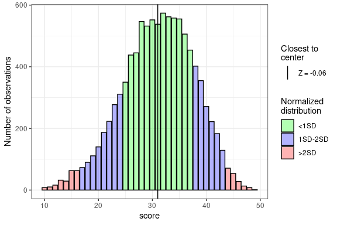

<!-- README.md is generated from README.Rmd. Please edit that file -->

# stenR 

<!-- badges: start -->

[](https://lifecycle.r-lib.org/articles/stages.html#experimental)
[](https://codecov.io/gh/StatisMike/stenR)
<!-- badges: end -->

`stenR` is a package tailored mainly for creators of psychological
questionnaires, though other social science researchers and survey
authors can benefit greatly from it.

It provides straightforward framework for normalization and
standardization of raw discrete scores to standardized scale of your
choosing. It follows simple work pattern:

-   create frequency table and compute Z-score corresponding to each raw
    score
-   create score table using some standard scale.
-   provide external raw score to be recalculated to standardized scale.

## Installation

You can install the current version from [GitHub](https://github.com/)
with:

``` r
# install.packages("devtools")
devtools::install_github("StatisMike/stenR")
```

## Usage

There are numerous functions and `S3` classes constructors to help
normalize and standardize discrete data.

``` r
library(stenR)
#> Loading required package: R6

# build-in dataset with questionnaire data
summary(HEXACO_60$HEX_C)
#>    Min. 1st Qu.  Median    Mean 3rd Qu.    Max. 
#>   17.00   30.00   35.00   35.42   40.00   50.00

# create STEN score table for variable
HEX_C_st <- HEXACO_60$HEX_C |>
  FrequencyTable() |>
  ScoreTable(STEN)

# use the STEN table to normalize and standardize data
HEX_C_sten <- HEXACO_60$HEX_C |>
  normalize_score(HEX_C_st, "sten")

summary(HEX_C_sten)
#>    Min. 1st Qu.  Median    Mean 3rd Qu.    Max. 
#>   1.000   4.000   5.000   5.495   7.000  10.000
```

There is also a special `R6` class making the whole process more
organized with potential inter-session continuity.

``` r
# inspect the whole dataset for comparison
head(HEXACO_60)
#>                   user_id sex age HEX_H HEX_E HEX_X HEX_A HEX_C HEX_O
#> 1 neutral_peregrinefalcon   F  26    42    33    34    36    36    31
#> 2   trapeziform_zebradove   F  24    38    31    36    44    36    28
#> 3    polyhedral_solenodon   F  26    18    17    16    42    35    37
#> 4      decrepit_norwayrat   F  25    21    24    29    22    43    47
#> 5          unawake_wisent   F  31    32    35    24    31    34    28
#> 6   turophilic_spreadwing   M  25    34    30    34    34    28    39

# initialize the object with some scale attached
HEX_ST <- CompScoreTable$new(
  scales = STEN
)

# you can use the `standardize` method to automatically calculate the tables
# during data calculation
HEXACO_sten <- HEX_ST$standardize(
  HEXACO_60,
  # specify the variables to calculate if there are any other in the data.frame
  vars = c("HEX_H", "HEX_E", "HEX_X", "HEX_A", "HEX_C", "HEX_O"),
  what = "sten",
  calc = TRUE)

# inspect the recalculated dataset
head(HEXACO_sten)
#>                   user_id sex age HEX_H HEX_E HEX_X HEX_A HEX_C HEX_O
#> 1 neutral_peregrinefalcon   F  26     8     5     7     8     6     3
#> 2   trapeziform_zebradove   F  24     7     5     7    10     6     2
#> 3    polyhedral_solenodon   F  26     2     2     2    10     5     5
#> 4      decrepit_norwayrat   F  25     2     3     6     3     8     9
#> 5          unawake_wisent   F  31     5     6     4     6     5     2
#> 6   turophilic_spreadwing   M  25     5     5     7     7     3     6

# CompScoreTable object have the table already populated for next data input
summary(HEX_ST)
#> <CompScoreTable> object
#> 
#> Attached <ScoreTables>:
#>  variable   n      range
#>     HEX_H 204 incomplete
#>     HEX_E 204 incomplete
#>     HEX_X 204 incomplete
#>     HEX_A 204 incomplete
#>     HEX_C 204   complete
#>     HEX_O 204 incomplete
#> 
#> Attached <StandardScales>:
#>  name   M SD min max
#>  sten 5.5  2   1  10
```

Above methods were focusing on using raw data available to us.
Unfortunately, when using another author’s questionnaire we often don’t
have their raw data available for calculating the *FrequencyTable* in
regular way.

Authors usually provide descriptive statistics about their data, though.
We can use it to estimate the frequencies and use it to normalize raw
scores gathered in our study.

``` r
simulated_ft <- SimFrequencyTable(
  min = 10, max = 50, M = 31.04, SD = 6.7, 
  skew = -0.3, kurt = 2.89, seed = 2678)
#> Constants: Distribution  1  
#> 
#> Constants calculation time: 0.008 minutes 
#> Total Simulation time: 0.009 minutes

plot(simulated_ft)
```

<!-- -->

``` r
normalize_score(HEXACO_60$HEX_A,
                table = ScoreTable(simulated_ft, STEN),
                "sten") |>
  summary()
#>    Min. 1st Qu.  Median    Mean 3rd Qu.    Max. 
#>   1.000   3.000   5.000   4.892   6.000  10.000
```
