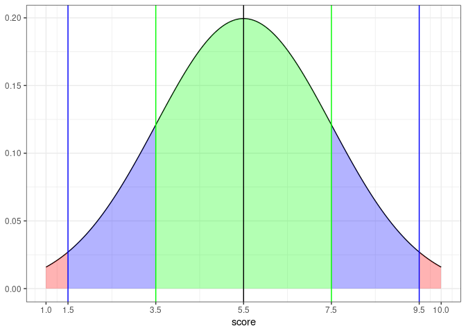
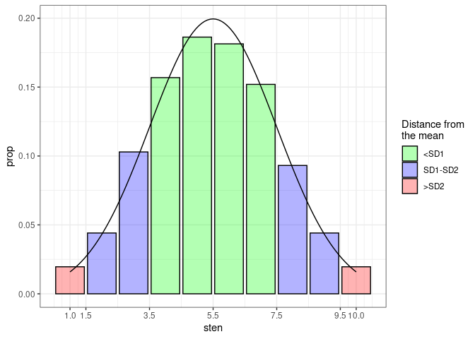
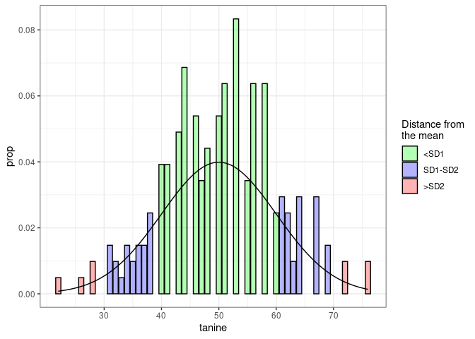
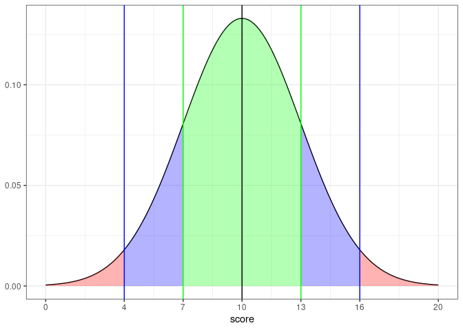

<!-- README.md is generated from README.Rmd. Please edit that file -->

# stenR

<!-- badges: start -->

[](https://lifecycle.r-lib.org/articles/stages.html#experimental)
<!-- badges: end -->

`stenR` is a package tailored mainly for creators of psychological
questionnaires, though other social science researchers and survey
authors can benefit greatly from it.

It provides straightforward framework for normalization and
standardization of raw discrete scores to standardized scale of your
choosing. It follows simple work pattern:

-   create frequency table and compute Z-score corresponding to each raw
    score
-   create score table using some standard scale.
-   provide external raw score to be recalculated to standardized scale.

## Installation

You can install the current version from [GitHub](https://github.com/)
with:

``` r
# install.packages("devtools")
devtools::install_github("StatisMike/stenR")
```

## Procedural workflow for using stenR functionality

`stenR` currently is based on few `S3` classes and can be used in purely
procedural workflow, which will be described below. Exemplary data
provided with package will be used:

``` r
library(stenR)
#> Loading required package: R6

# data gathered in Polish sample - 204 summed results of HEXACO-60 questionnaires
str(HEXACO_60)
#> 'data.frame':    204 obs. of  9 variables:
#>  $ user_id: chr  "neutral_peregrinefalcon" "trapeziform_zebradove" "polyhedral_solenodon" "decrepit_norwayrat" ...
#>  $ sex    : chr  "F" "F" "F" "F" ...
#>  $ age    : int  26 24 26 25 31 25 62 19 24 26 ...
#>  $ HEX_H  : int  42 38 18 21 32 34 37 39 41 30 ...
#>  $ HEX_E  : int  33 31 17 24 35 30 37 13 33 24 ...
#>  $ HEX_X  : int  34 36 16 29 24 34 39 27 23 34 ...
#>  $ HEX_A  : int  36 44 42 22 31 34 23 27 15 21 ...
#>  $ HEX_C  : int  36 36 35 43 34 28 41 19 49 38 ...
#>  $ HEX_O  : int  31 28 37 47 28 39 44 42 22 38 ...
```

### 1. Create a Frequency Table object on basis of some variable

``` r
HEX_H_ft <- FrequencyTable(HEXACO_60$HEX_H)
#> Warning in FrequencyTable(HEXACO_60$HEX_H): There are missing score values
#> between minimum and maximum scores. They have been filled automatically.
HEX_H_ft
#> <FrequencyTable> computed on: 204 observations
#> range: incomplete (missing raw score values between <min> and <max>) 
#> 
#>  score  n      freq       quan           Z
#>     14  1 0.4901961  0.2450980 -2.81340671
#>     15  1 0.4901961  0.7352941 -2.43954226
#>     16  2 0.9803922  1.4705882 -2.17792307
#>     17  0 0.0000000  1.4705882 -2.17792307
#>     18  3 1.4705882  2.6960784 -1.92746610
#>     19  2 0.9803922  3.9215686 -1.75986103
#>     20  1 0.4901961  4.6568627 -1.67907589
#>     21  3 1.4705882  5.6372549 -1.58597448
#>     22  0 0.0000000  5.6372549 -1.58597448
#>     23  2 0.9803922  6.8627451 -1.48609157
#>     24  3 1.4705882  8.0882353 -1.39916101
#>     25  3 1.4705882  9.5588235 -1.30710672
#>     26  5 2.4509804 11.5196078 -1.19934929
#>     27  8 3.9215686 14.7058824 -1.04913140
#>     28  8 3.9215686 18.6274510 -0.89170883
#>     29 10 4.9019608 23.0392157 -0.73755598
#>     30 14 6.8627451 28.9215686 -0.55567745
#>     31 11 5.3921569 35.0490196 -0.38399738
#>     32  7 3.4313725 39.4607843 -0.26732923
#>     33  9 4.4117647 43.3823529 -0.16664795
#>     34 11 5.3921569 48.2843137 -0.04301914
#>     35 13 6.3725490 54.1666667  0.10463346
#>     36 17 8.3333333 61.5196078  0.29288789
#>     37  7 3.4313725 67.4019608  0.45103991
#>     38 13 6.3725490 72.3039216  0.59189400
#>     39 13 6.3725490 78.6764706  0.79524571
#>     40  5 2.4509804 83.0882353  0.95765790
#>     41  6 2.9411765 85.7843137  1.07067914
#>     42  5 2.4509804 88.4803922  1.19934929
#>     43  2 0.9803922 90.1960784  1.29280523
#>     44  6 2.9411765 92.1568627  1.41570209
#>     45  6 2.9411765 95.0980392  1.65443473
#>     46  3 1.4705882 97.3039216  1.92746610
#>     47  0 0.0000000 97.3039216  1.92746610
#>     48  0 0.0000000 97.3039216  1.92746610
#>     49  2 0.9803922 98.5294118  2.17792307
#>     50  2 0.9803922 99.5098039  2.58266941
```

Generated warning tells us that there were some raw scores between
`min()` and `max()` values that weren’t represented in the sample. We
can see that was the case for a few scores:

``` r
which(HEX_H_ft$table$n == 0)
#> [1]  4  9 34 35
```

We can also see it while plotting the resulting *FrequencyTable*:

``` r
plot(HEX_H_ft)
```


By the rule of thumb: the more possible values the raw scores can get
and the smaller your data, the bigger possibility for this to happen. If
you feel that your sample was representative, you can ignore it. It is
recommended though to get more varied, greater number of observations
when getting this warning.

### 2. Generate ScoreTable using FrequencyTable

*FrequencyTable* is a basis for normalizing the distribution of your
data. Now, the next step is to standardize it using some *StandardScale*
and generating *ScoreTable*.

There are some *StandardScale* objects available in the package. They
define score scale. We can use the popular in psychology **STEN** scale
to calculate the scores.

``` r
# check out the scale definition
STEN
#> <StandardScale>: 'sten'
#> ( M: 5.5; SD: 2; min: 1; max: 10 )
# see its distribution graphically
plot(STEN)
```



Now, we can generate the ScoreTable using our FrequencyTable and scale
of our choosing.

``` r
HEX_H_st <- ScoreTable(HEX_H_ft, STEN)

plot(HEX_H_st)
```



We can see that the shape of the generated distribution is similar to
the distribution associated with the *StandardScale*. It is a good sign:
number of values of raw scores is appropriate for the chosen scale. In
contrast, we can see that the **TANINE** scale would be an ill choice:

``` r
plot(ScoreTable(HEX_H_ft, TANINE))
```



You can also define your own *StandardScale* object using the
`StandardScale` function.

``` r
new_scale <- StandardScale("my_scale", 10, 3, 0, 20)

# let's see if everything is correct
new_scale
#> <StandardScale>: 'my_scale'
#> ( M: 10; SD: 3; min: 0; max: 20 )

# how does its distribution looks like?
plot(new_scale)
```



### 3. Calculate score for the new results

Now, if we have our *ScoreTable* created, we can use it to standardize
some scores! We will do it for some randomly generated ones using
`normalize_score()` function:

``` r
set.seed(2137)

# generate some random raw scores of valid values
raw_scores <- round(runif(10, min = 10, max = 50), 0)

print(raw_scores)
#>  [1] 19 12 14 45 20 22 30 39 33 23

# and now - get the 'STEN' values!
normalize_score(
  x = raw_scores,
  table = HEX_H_st,
  what = "sten")
#>  [1] 2 1 1 9 2 2 4 7 5 3
```

## Object oriented workflow

IN PROGRESS
